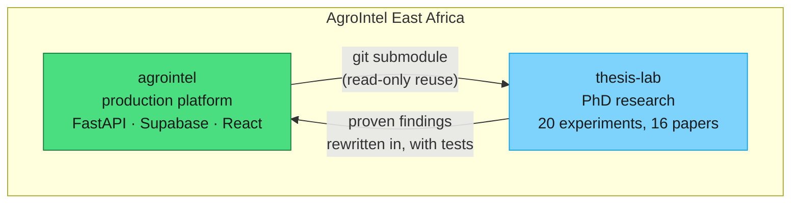
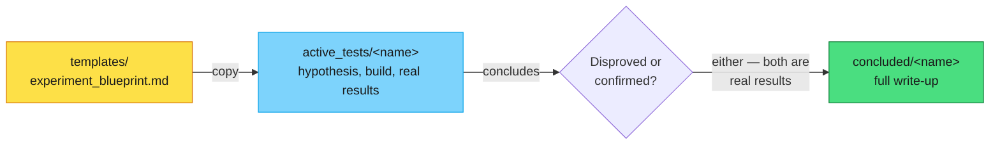

# AgroIntel Thesis Lab

<div align="center">

[](PUBLICATION_ROADMAP.md)
[](active_tests/)
[](PUBLICATION_ROADMAP.md#papers--experiments)

**Part of [AgroIntel East Africa](https://github.com/AgroIntel-EastAfrica)** · production repo: [`agrointel`](https://github.com/AgroIntel-EastAfrica/agrointel)

</div>

PhD research lab for **"Agentic Intelligence Under Uncertainty"** — a set of
controlled experiments studying how agentic AI systems should behave when
evidence is sparse, unreliable, or heterogeneous, grounded in a real
production agricultural-intelligence platform
([`agrointel`](https://github.com/AgroIntel-EastAfrica/agrointel)) rather
than synthetic benchmarks alone.

## Structure

```
thesis-lab/
├── templates/          # experiment_blueprint.md — the starting shape for a new experiment
├── active_tests/        # one folder per in-progress experiment
├── concluded/           # finished experiments (successful or not — a disproved
│                         #   hypothesis is still a real result), full write-up included
├── agrointel/            # git submodule — real, read-only access to production service code
└── PUBLICATION_ROADMAP.md  # maps this lab's experiments to a 16-paper PhD structure
```

### How this lab relates to `agrointel`



### Experiment lifecycle



## Setup

This repo includes [`agrointel`](https://github.com/AgroIntel-EastAfrica/agrointel)
as a git submodule, since most experiment scripts import real service code
directly (e.g. `from services.market.faostat_prices import ...`) rather than
mocking it — several experiments are audit-style, measuring the real
system's real behavior, which a synthetic substitute would defeat.

```bash
git clone --recurse-submodules https://github.com/AgroIntel-EastAfrica/thesis-lab.git
# or, if already cloned without submodules:
git submodule update --init
```

The submodule tracks `agrointel`'s `develop` branch. To pull the latest:

```bash
git submodule update --remote agrointel
```

## Ground rules

- **No production writes.** Experiments never write to or mutate production
  Supabase tables, and never call a paid production external service for
  exploratory/throwaway work. **Read-only** access to real production data
  is fine for audit-style experiments whose entire point is measuring real
  system behavior — a mocked substitute would defeat the experiment.
- **One-directional boundary.** Nothing in `agrointel`'s own codebase
  (`apps/`, `services/`, `core/`) imports from this lab. An experiment that
  proves out gets *rewritten* into the real `agrointel` codebase — with real
  tests and real error handling — never wired in directly.
- **Isolated dependencies.** A package an experiment needs goes in a
  `requirements.txt` inside that experiment's own folder, not a shared one.
- **Same code style, different bar.** Experiment code passes `ruff check .`
  but isn't held to production-readiness or coverage requirements.
- **Lifecycle.** Start a new experiment by copying
  `templates/experiment_blueprint.md` into `active_tests/<name>/`. When it
  concludes, fill in its Results section and move it to `concluded/<name>/`.

## Research thrusts

20 experiments map onto a 16-paper structure across three thrusts — see
[`PUBLICATION_ROADMAP.md`](PUBLICATION_ROADMAP.md) for the full
paper-by-paper table and how it was assembled.

| Thrust | Papers | Focus |
|---|---|---|
| 1 — Learning from heterogeneous, data-sparse information | 2–7 | Multimodal representation, dynamic market graphs, distribution-shift robustness, calibration, cross-market transfer |
| 2 — Agentic reasoning and evidence acquisition | 8–11 | Evidence retrieval/attribution, acquisition policy, conflicting evidence, continuous monitoring |
| 3 — Reliable adaptation and decision support | 12–14 | Continual learning, human-AI decision support, trustworthy AI under unequal data availability |
| Infrastructure & synthesis | 1, 15, 16 | Framework paper, AgriBench-EA benchmark, evaluation framework — bookends and shared resources |

**Status**: 8 papers active, 8 not yet started (mostly dependent on an
earlier paper's results landing first), 1 experiment concluded
(`regional-equity-audit` → redesigned into Paper 14).

## Current focus

The active flagship experiment is
[`evidence-sparsity-reliability`](active_tests/evidence-sparsity-reliability/experiment_blueprint.md)
(Paper 14): does evidence availability, quality, and calibration affect the
reliability of agricultural AI intelligence under real data-sparse
conditions? Built on a real gold-standard dataset spanning five evidence
modalities across Kenya, Rwanda, South Sudan, and Somalia:

| Modality | Real time series? | Key finding |
|---|---|---|
| Price | ✅ 157 obs, 1991–2024 | Splits cleanly by country tier (KE/RW real, SS/SO synthetic) |
| Production | ✅ 465 obs, 1961–2024 | Uniform across countries, varies by commodity (maize tracked, coffee/tea not, for SS/SO) |
| Weather | ✅ 272 obs, 1991–2024 | Uniform across *all* countries regardless of tier — cleanest modality |
| Trade | ❌ single snapshot | KE-only real data; RW/SS/SO confirmed genuine zero — quota-limited (UN Comtrade) |
| Text/news | ❌ single snapshot | Reliability-limited (~2/12 GDELT calls succeed) — an evidence-*quality*, not *availability*, finding |

Two experiments have real results so far: **E1** (forecasting under
controlled evidence availability — adding weather measurably helped
directional accuracy, adding production was mixed and traced to a real
mechanism) and **E2** (calibration — a distribution-free method
measurably beat a naive one, though the pre-registered severity
threshold wasn't met). See the experiment's own blueprint for the full,
continuously-updated results log.
