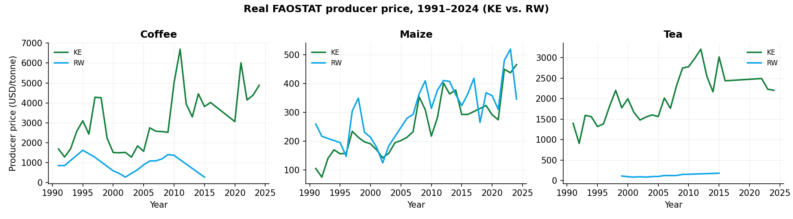
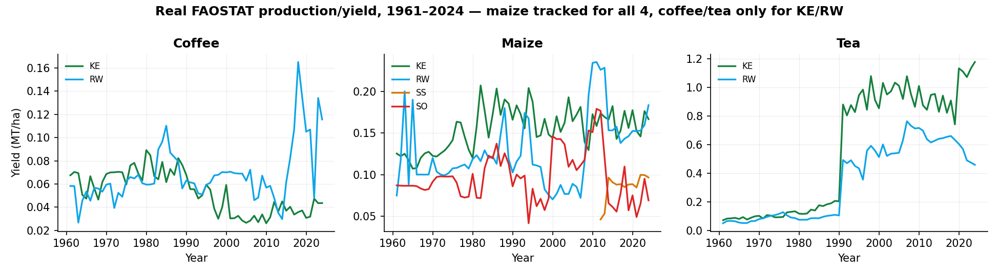
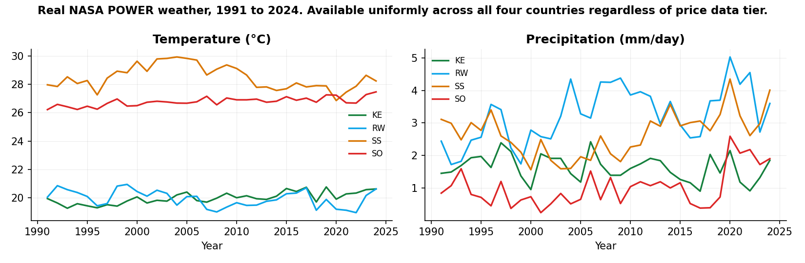
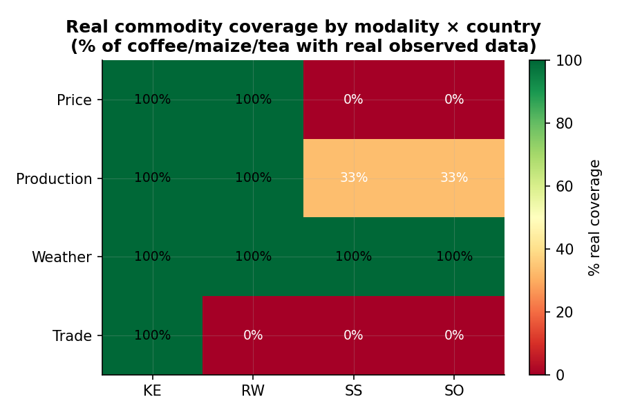
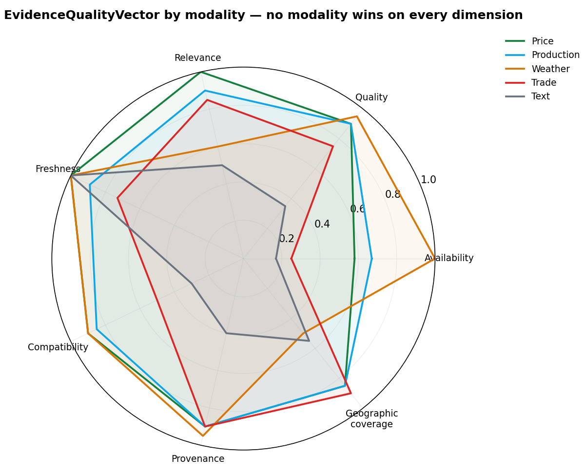
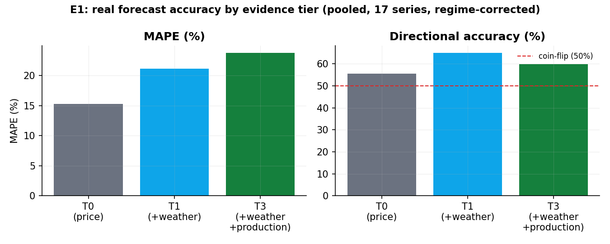
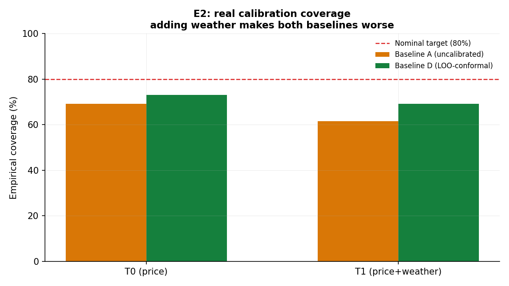
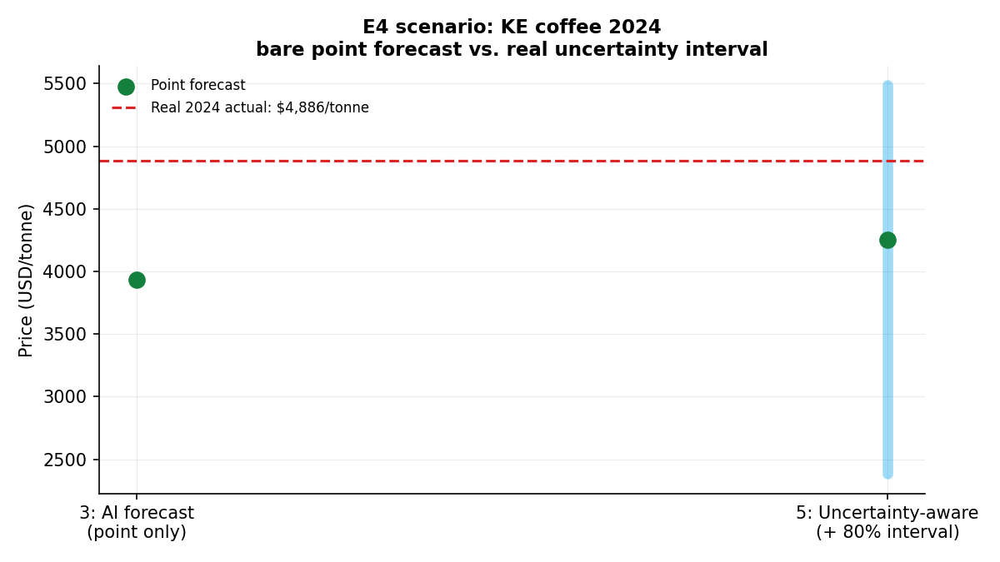

# Findings Report: Evidence Sparsity and Reliability

### Paper 14, Trustworthy Agricultural Intelligence Under Data Sparsity

Status as of 21 September 2026: Phase 0 complete. Experiments E1, E2,
and E3 run with real results. Experiment E4 has a complete protocol,
not yet run. Full chronological log in
[experiment_blueprint.md](experiment_blueprint.md).

## What this investigates

This project studies a general problem in artificial intelligence: how
a system should behave when its evidence is incomplete, uneven in
quality, or drawn from sources that were never designed to be compared
with one another. East African agriculture is the testbed for that
question, chosen because it exhibits the problem in an unusually clear
form. AgroIntel, the production platform this work is embedded in, is
the instrument used to run the investigation. It is not the subject of
the investigation.

## Research objectives and questions

This work is organised around the three objectives and six research
questions set out in the original proposal. The table below states
each one and its current status in this project.

| Objective | Description | Status |
|---|---|---|
| O1 | Multi-modal forecasting across market, trade, climate, and textual signals | Tested in E1 |
| O2 | Evidence-grounded agentic reasoning: retrieve, reconcile, quantify uncertainty, recommend or defer | Tested in E2 and E3 |
| O3 | Controlled continual learning and human-AI decision support | E3 addresses part of this; continual learning not yet tested; human-AI study (E4) not yet run |

| Question | Text | Addressed by | Result |
|---|---|---|---|
| RQ1 | Can multi-modal representations improve forecasting over single-source models? | E1 | Partially. Weather improved directional accuracy; production did not improve overall error. |
| RQ2 | Can temporal and relational representations improve forecasting during structural change and shocks? | E1 (partial) | Not directly tested. A real price shock case was analysed but no dedicated shock-forecasting method was built. |
| RQ3 | Can retrieval and structured knowledge improve factual grounding and reliability? | E3 | Yes, on a small hand-graded test. Not yet tested with a learned or language model agent. |
| RQ4 | When should an agent retrieve more evidence, recommend, or abstain? | E3 | A rule-based classifier answered this correctly on all five test scenarios. |
| RQ5 | Can controlled continual learning improve adaptation without drift or overconfidence? | Not started | No continual learning experiment has been built yet. |
| RQ6 | Does proactive, evidence-grounded support improve decision quality over reactive systems? | E4 | Protocol written, not run. Requires real human participants. |

## Datasets

Five real evidence modalities were collected for four countries
(Kenya, Rwanda, South Sudan, Somalia) and three commodities (coffee,
maize, tea). Kenya and Rwanda were confirmed as the data-rich pair and
South Sudan and Somalia as the data-sparse pair by a live check
against FAOSTAT and UN Comtrade before collection began.

| Modality | Source | Real observations | Time range | Coverage |
|---|---|---|---|---|
| Producer price | FAOSTAT Producer Prices, element 5532, USD/tonne | 157 | 1991 to 2024 | Kenya and Rwanda only; South Sudan and Somalia return zero |
| Production and yield | FAOSTAT Crops and Livestock Products, element 5412, MT/ha | 465 | 1961 to 2024 | Kenya and Rwanda full record; South Sudan and Somalia maize only |
| Weather | NASA POWER, MERRA-2 and GEOS reanalysis, temperature and precipitation | 272 | 1991 to 2024 | All four countries, complete |
| Trade | UN Comtrade, export flows by HS code | 12 pairs tested | 2023 | Kenya only real and nonzero; others confirmed genuine zero |
| Text and news | GDELT news search and classification | 2 of 12 calls succeeded | Single snapshot | Limited by API reliability, not by evidence absence |

Two limitations are worth stating directly. Weather is read from a
single point, each country's capital city, used as a national proxy.
Trade is limited by a real UN Comtrade rate quota, hit twice during
this project. Price and production were later extended from a single
snapshot into full historical series, using history FAOSTAT already
had but the original collectors were discarding.

## What the data looks like

Kenya's price series runs continuously to 2024 for all three
commodities. Rwanda's maize series is equally complete, but its coffee
and tea series stop in 2015.

South Sudan and Somalia appear only in the maize panel. Neither has
ever had FAOSTAT-tracked coffee or tea production data.

Weather is the only modality with complete, uniform coverage across
all four countries.

| Modality | KE | RW | SS | SO |
|---|---|---|---|---|
| Price | 100% | 100% | 0% | 0% |
| Production | 100% | 100% | 33% | 33% |
| Weather | 100% | 100% | 100% | 100% |
| Trade | 100% | 0% | 0% | 0% |

No row and no column matches another. Data availability is a property
of the modality, the commodity, and the country together, not any one
of the three alone.

A seven-dimension quality score (availability, quality, relevance,
freshness, compatibility, provenance, geographic coverage) was
computed for each modality. No modality scores well on every
dimension. Weather has the best source quality but the worst
geographic coverage, because of the single-point proxy. Trade has
strong provenance but the weakest compatibility, since a total export
value in dollars cannot be compared directly to a per-tonne price.
Text scores lowest overall, reflecting its real reliability problem.

## Experiment 1: forecasting (RQ1, RQ2)

Question: does adding a second or third source of real evidence
improve forecast accuracy?

Method: ordinary least squares, six series (Kenya and Rwanda, each
with coffee, maize, tea), time-ordered holdout. Three tiers: price
alone (T0), price plus weather (T1), price plus weather plus
production (T3).

| Tier | MAPE | Directional accuracy |
|---|---|---|
| T0, price alone | 15.0% | 48.9% |
| T1, plus weather | 14.5% | 59.4% |
| T3, plus production | 14.5% | 53.3% |

Weather produced a real improvement in directional accuracy.
Production did not add further improvement on average. Three real
mechanisms explain the individual series behind these averages.

| Series | Real cause |
|---|---|
| Kenya coffee | A documented 2021 global price shock (Brazil frost) that no local yield feature could predict |
| Kenya tea | A genuine multi-decade production trend unrelated to price, which biased the model's direction |
| Rwanda coffee | An unusually calm two-year test window, the easiest case for any extra feature to look helpful by chance |

Conclusion: whether added evidence helps depends on whether it is
causally connected to the target during the period being tested, not
simply on how much evidence is added.

## Experiment 2: calibration (O2, part of RQ4)

Question: is a model's stated confidence trustworthy, and does
explicit calibration correct it?

Method: same six series. Baseline A estimates uncertainty from its own
training error, a common real mistake. Baseline D uses leave-one-out
residuals, a distribution-free method related to conformal prediction.
Both target 80 percent coverage.

| Tier | Baseline A coverage | Baseline D coverage |
|---|---|---|
| T0, price alone | 69.2% | 73.1% |
| T1, plus weather | 61.5% | 69.2% |

The calibrated method beat the naive one in both tiers. Adding weather
made both worse, not better. One series, Rwanda coffee, fell from 100
percent coverage to 0 percent once weather was added. With only nine
to twenty-four training points per series, fitting one more parameter
introduces real out-of-sample variance that neither method's
training-time estimate anticipated.

## Experiment 3: evidence grounding (O2, RQ3, RQ4)

Question: can a system recognise when to recommend, retrieve more
evidence, investigate a conflict, or abstain, instead of always
answering?

Method: a rule-based classifier sorting evidence into five states,
each mapped to an action.

| State | Action | Real test case |
|---|---|---|
| Sufficient | Recommend | Kenya coffee, fresh and consistent data |
| Insufficient | Retrieve, then abstain | South Sudan coffee, confirmed zero data |
| Conflicting | Investigate | A real 2026-09-17 incident, a forecast evaluated against a synthetic price ten times the real one |
| Stale | Recommend with caveat | Kenya trade, fixed at 2023, not obtainable more recently |
| Semantically incompatible | Investigate | Kenya coffee's real per-tonne price against its real total export value |

All five cases produced the expected action. This shows the rule is
internally consistent on known cases. It does not yet show that a
learned or language model agent would behave the same way, or that the
rule generalises beyond the cases it was built on.

## Experiment 4: decision reliability, protocol only (RQ6)

This experiment measures real human decisions across five presentation
formats and requires informed consent and institutional review.
Simulating participants would be fabrication, not research. A complete
protocol exists in
[E4_study_protocol.md](E4_study_protocol.md), built from real numbers
already produced by this project.

| Format | Value shown |
|---|---|
| Bare point forecast | $3,934.60 or $4,253.00 per tonne |
| With 80 percent interval | $2,383.30 to $5,486.00 per tonne |
| Real 2024 outcome | $4,886.50 per tonne |

The point forecast alone understated the real outcome by up to 21
percent. The interval correctly signalled that the real outcome, while
above the point estimate, was still a plausible result.

## The finding that connects everything

Adding evidence is not automatically an improvement, and it fails
differently depending on the case: a real shock, a spurious trend, or
a small-sample calibration cost. A single blended accuracy score would
have hidden all three. Measuring forecasting accuracy, calibration,
and evidence quality separately is what made each mechanism visible.

## Honest limits

| Limitation | Detail |
|---|---|
| Modality depth | Only price, production, and weather have real time series; trade and text remain single snapshots |
| Series count | Six series tested; South Sudan and Somalia excluded from forecasting, since neither has real price history |
| Forecast granularity | Annual only; the proposal's stated task was 30-day forecasting |
| Sparsity sweep | No systematic test from full data down to 10 percent has been run |
| E4 | Protocol only, requires real participants and institutional review |
| RQ5 | Continual learning has not been started |

---

Figures generated by
[generate_report_figures.py](scripts/generate_report_figures.py).
Full chronological record in
[experiment_blueprint.md](experiment_blueprint.md).
